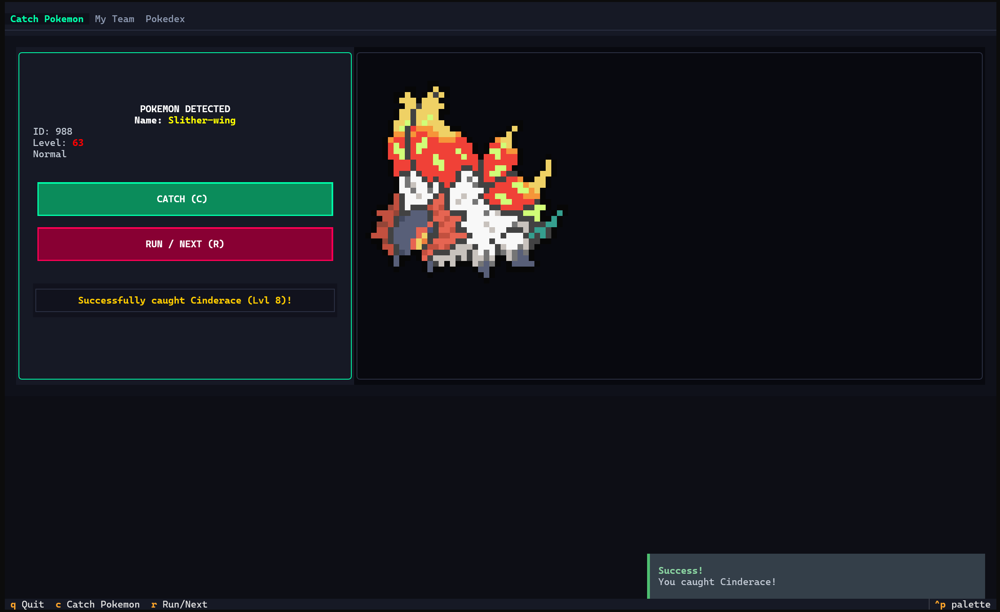
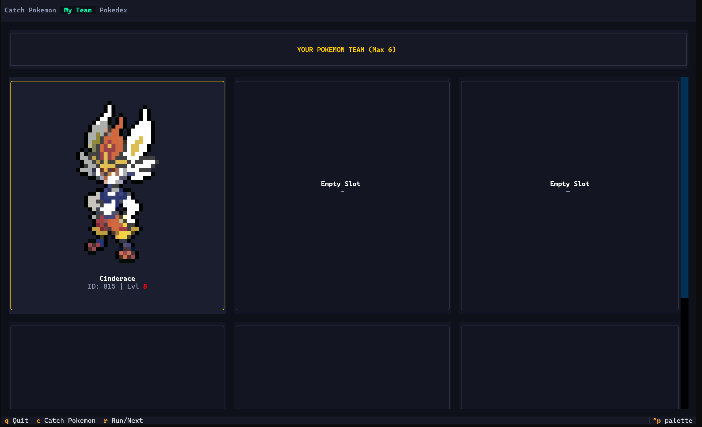
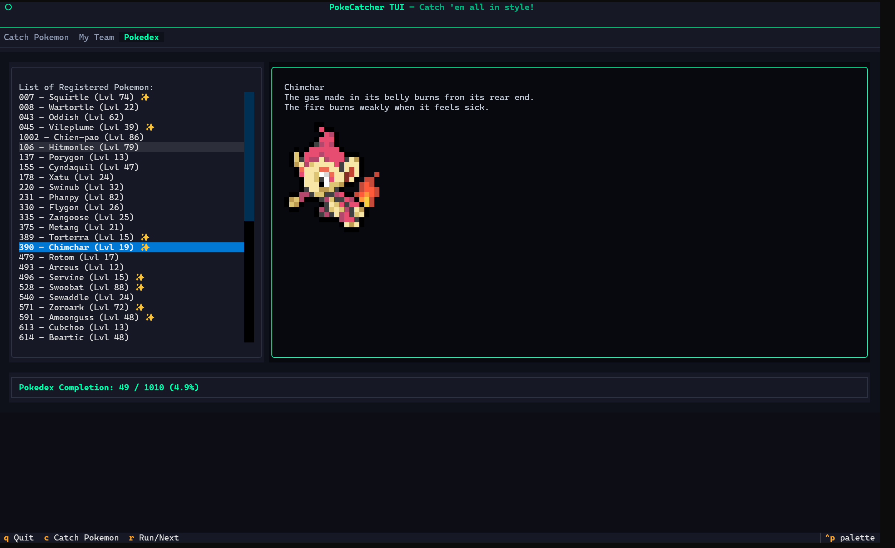
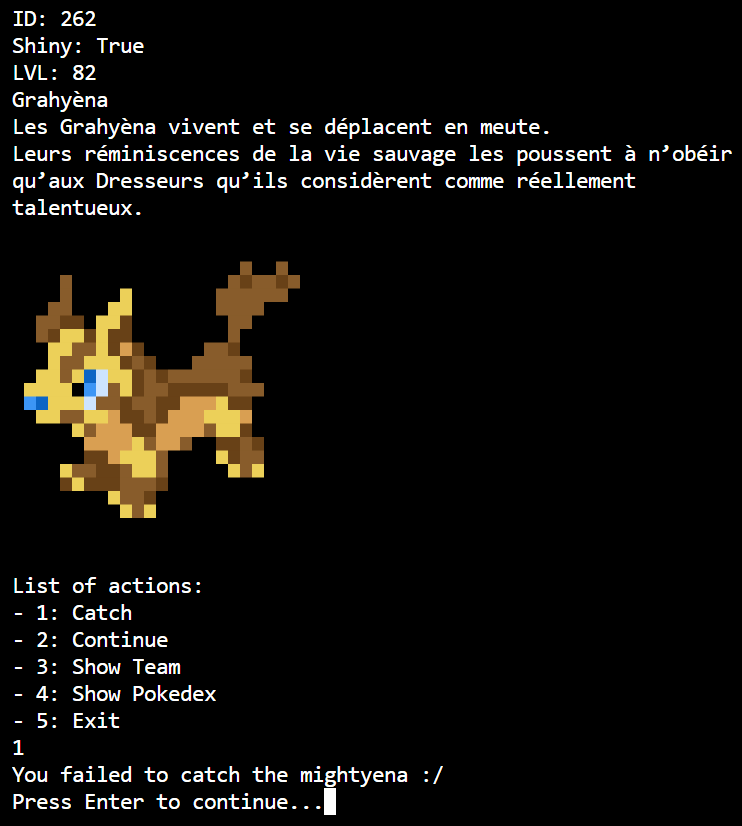

# 🎮 PokeCatcherShell

<p align="center">
  
  
  
</p>

---

## 📝 Description

**PokeCatcherShell** is a retro-inspired, shell-based Pokémon catching game. Track down wild Pokémon, capture them to build your ultimate 6-member team, hunt for ultra-rare **Shiny Pokémon**, and complete your local PokéDex!

The game comes in two flavors:
1. **Interactive CLI Mode** – A simple, classic text-adventure loop.
2. **Immersive TUI Mode** – A rich, beautiful, fully responsive Terminal User Interface featuring tabs, grid views, interactive list menus, and real-time status updates powered by [Textual](https://github.com/Textualize/textual).

Both modes utilize [Krabby](https://github.com/yannjor/krabby) to print detailed, vibrant ANSI Pokémon sprites directly into your terminal!

---

## ✨ Features

- 👾 **User Interface:** Play in either a stunning, modern TUI dashboard (`main.py`) or a lightweight classic CLI (`old.py`).
- ✨ **Shiny Hunting:** Encounter Shiny Pokémon with unique visual indicators and custom purple color-themed team frames.
- 📁 **PokéDex Persistence:** Automatically saves your collection inside a local `pokedex.json` file. Your best catches (highest level/shiny status) are automatically kept!
- 🖼️ **ANSI Sprites:** Gorgeous full-color, retro graphics pulled dynamically from your terminal.
- ❄️ **Nix Shell Integration:** Instant setup with fully reproducible developer flakes—no manual Python dependency management required!

---

## 📸 Screenshots

### 🎛️ Modern TUI Dashboard (Textual)

#### ⚔️ Wild Spawn & Encounter


#### 🏆 Active Team Roster


#### 📁 Registered PokéDex Collection


### 💻 Classic CLI Version (Terminal)

#### ⚔️ Wild Encounter


---

## 🚀 Getting Started

### ❄️ Option A: The Nix Way (Recommended)
If you use Nix/NixOS with `direnv` enabled, simply navigate into the directory and everything will configure automatically!
Alternatively, start the reproducible environment manually:
```bash
nix develop
```
Then, execute the launch script:
```bash
# To start the gorgeous TUI mode (default)
./run.sh

# To start the classic CLI mode
./run.sh --cli
```

### 🐍 Option B: Manual Setup
If you are not using Nix, ensure you have Python 3.10+ and Cargo installed.

1. **Install Krabby** (provides the Pokémon sprite engine):
   ```bash
   cargo install krabby
   ```
2. **Install Python dependencies**:
   ```bash
   pip install textual rich
   ```
3. **Run the Game**:
   ```bash
   # Modern TUI
   python3 main.py

   # Classic CLI
   python3 old.py
   ```

---

## 🎮 How to Play

### 💻 Classic CLI Mode
Simply input numbers to take actions:
1. **Catch**: Throw a Pokéball! Capture success depends on the Pokémon's level.
2. **Continue**: Skip the encounter and look for another wild Pokémon.
3. **Show Team**: Inspect your current 6-Pokémon team.
4. **Show PokéDex**: Browse your lifetime collection.
5. **Exit**: Save and exit.

### 🎛️ TUI Mode Keybindings & Navigation
| Key | Action |
|:---:|:---|
| `Tab` | Switch between **Catch**, **My Team**, and **PokéDex** screens |
| `C` / Click "Catch" | Attempt to capture the wild Pokémon |
| `R` / Click "Run" | Flee and spawn a new wild Pokémon |
| `Click Release` | Remove a Pokémon from your team under the **My Team** view |
| `Q` | Quit the application |

---

## ⚙️ Customization & Tweaks
You can easily adjust game difficulty and rates by modifying the `config.json` file in the root of the project:

```json
{
  "shiny_rate": 1,
  "catch_rate": 1,
  "team_size": 6,
  "max_lvl": 100
}
```

### Parameter Explanations:
- `shiny_rate` – Spawn rate percentage for Shiny Pokémon (e.g., `1` for 1%, `50` for 50%).
- `catch_rate` – Capture multiplier (higher value = easier to catch).
- `team_size` – Size of your active squad (maximum 6).
- `max_lvl` – Maximum level for wild encounters.

If `config.json` is missing or unreadable, the game automatically falls back to these safe default values.

---

## 🤝 Contributor

- **Théodore Magna** – [GitHub Profile](https://github.com/theodoreEpitech)